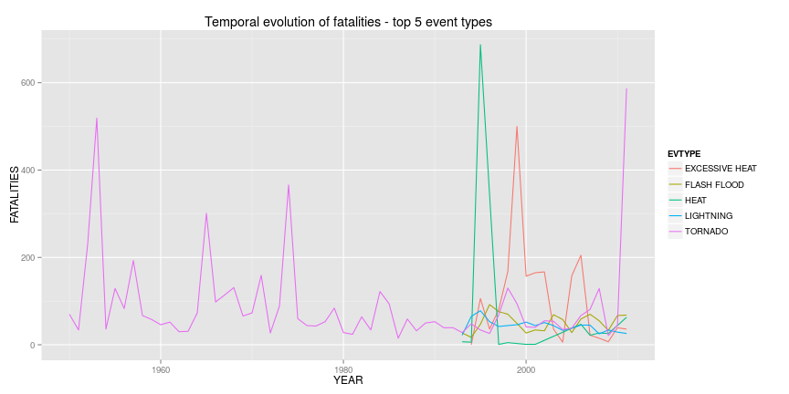
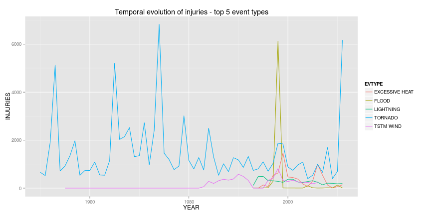
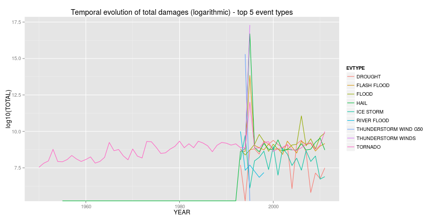

Beware the TORNADOs! They kill, they maim, and they cost a ton
========================================================

## Synopsis

Extreme atmospheric events create large personal and economic damages across the US. Taking data from the US Storm Data dataset, we investigate which kind of events has more health and economic impact. Tornadoes are overall the most dangerous events, especially for public health (although excessive heat can also cause very high damage to public health, in terms of fatalities), but also and in terms of economic damage (although in this regard, other events such as floods even surpass their economic damages).

## Data processing

We download the dataset and load it into a dataframe for later analysis. We also calculate some helpful variables for each entry, such as the year on which the event took place (to be used later for seeing the temporal evolution of events), or the calculation of the damage quantities, which are split over multiple numerical and textual values.


```r
require(gdata)
require(ggplot2)

# This function calculates the absolute value of a damage, expressed as a number plus an exponent. This exponent can be a number (e.g., "2" would mean multiply by 10^2 or 100), or a letter (k/K for 1000s, m/M for millions, b/B for billions). All other cases are ignored
getAbsoluteValue <- function(number,exp){
    newnumber <- 0;
    if(tolower(exp)=="k"){
        newnumber <- number*1000
    }else if(tolower(exp)=="m"){
        newnumber <- number*1000*1000
    }else if(tolower(exp)=="b"){
        newnumber <- number*1000*1000*1000
    }else if(!is.na(numexp <- suppressWarnings(as.numeric(exp)))){
        newnumber <- number*(10^numexp)
    }else{
        newnumber <- number
    }
    #We return the newly calculated value
    newnumber
}

# The first time you download the code, you can run the downloading and extraction of the data
setwd("/home/lprisan/workspace/Coursera/ReproducibleResearch/RepData_PeerAssessment2")
if(!file.exists("RepData_PA2-data.bz2")){
    download.file("https://d396qusza40orc.cloudfront.net/repdata%2Fdata%2FStormData.csv.bz2", "RepData_PA2-data.bz2", "wget")
}
rawdata <- read.csv(bzfile("RepData_PA2-data.bz2"))

# We add the year for each event, from the begin date of the event
rawdata$YEAR <- as.numeric(getYear(as.Date(rawdata$BGN_DATE, format="%m/%d/%Y %H:%M:%S")))
# We add the absolute value for property and crop damages
rawdata$PROP <- mapply(getAbsoluteValue,rawdata$PROPDMG,rawdata$PROPDMGEXP)
rawdata$CROP <- mapply(getAbsoluteValue,rawdata$CROPDMG,rawdata$CROPDMGEXP)
```

## Results

### Question 1: Across the United States, which types of events are most harmful with respect to population health?

As a first approximation to the answer to this question, we will calculate the total number of fatalities and injuries caused by the different kinds of events (as shown by the EVTYPE variable), and calculate the total number of deaths and injured people across the whole dataset.


```r
# We calculate the total number of fatalities and injuries per EVTYPE, and get the maximum value
total.health.ag <- aggregate(cbind(FATALITIES,INJURIES) ~ EVTYPE, data=rawdata, FUN="sum")
print(paste("Most harmful event type (Total Fatalities): ",total.health.ag[total.health.ag$FATALITIES==max(total.health.ag$FATALITIES),"EVTYPE"],total.health.ag[total.health.ag$FATALITIES==max(total.health.ag$FATALITIES),"FATALITIES"],"dead"))
```

```
## [1] "Most harmful event type (Total Fatalities):  TORNADO 5633 dead"
```

```r
print(paste("Most harmful event type (Total Injuries): ",total.health.ag[total.health.ag$INJURIES==max(total.health.ag$INJURIES),"EVTYPE"],total.health.ag[total.health.ag$INJURIES==max(total.health.ag$INJURIES),"INJURIES"],"injured"))
```

```
## [1] "Most harmful event type (Total Injuries):  TORNADO 91346 injured"
```

As we can see, **tornados** are overall the most harmful events, both from the point of view of deaths and from the point of view of injured people. 

However, is this the case **every year**, or are a few very bad tornado years skewing our data? In order to see that, we will get the top 5 events in terms of fatalities, and see their evolution over time on a year-by-year basis.


```r
# We aggregate the fatalities and injuries per event type and year
yearly.health.ag <- aggregate(cbind(FATALITIES,INJURIES) ~ EVTYPE + YEAR, data=rawdata, FUN="sum")

# We calculate the top 5 fatality sources in total aggregate
sorted.total.ag <- total.health.ag[with(total.health.ag, order(-FATALITIES)),]
top.5.fatal <- sorted.total.ag[1:5,"EVTYPE"]

# We filter the yearly aggregate to have only the top 5 causes
top.5.yearly.fatality.ag <- yearly.health.ag[yearly.health.ag$EVTYPE %in% top.5.fatal,]

# We plot the progression over time of the top 5 EVTYPES in terms of , to see the temporal evolution/trends
qplot(YEAR,FATALITIES,data=top.5.yearly.fatality.ag, colour=EVTYPE, geom="line", main = "Temporal evolution of fatalities - top 5 event types")
```

 

```r
# We do the same again with the injuries
sorted.total.ag <- total.health.ag[with(total.health.ag, order(-INJURIES)),]
top.5.inj <- sorted.total.ag[1:5,"EVTYPE"]

# We filter the yearly aggregate to have only the top 5 causes
top.5.yearly.inj.ag <- yearly.health.ag[yearly.health.ag$EVTYPE %in% top.5.inj,]

# We plot the progression over time of the top 5 EVTYPES in terms of , to see the temporal evolution/trends
qplot(YEAR,INJURIES,data=top.5.yearly.inj.ag, colour=EVTYPE, geom="line", main = "Temporal evolution of injuries - top 5 event types")
```

 

Surprisingly, we see that there are data for tornados from much longer than the other event types. Thus, just to check, we calculate the total number of fatalities and injuries, now **taking into account only the years from 1993** (where we have data about the other kinds of events)


```r
# We filter the data from 1993 onwards, and aggregate again
lately.data <- rawdata[rawdata$YEAR>=1993,]
lately.health.ag <- aggregate(cbind(FATALITIES,INJURIES) ~ EVTYPE, data=lately.data, FUN="sum")

# We calculate the new maximums, and check the other one in each case, for comparison
print(paste("Most harmful event type since 1993 (Total Fatalities): ",lately.health.ag[lately.health.ag$FATALITIES==max(lately.health.ag$FATALITIES),"EVTYPE"],lately.health.ag[lately.health.ag$FATALITIES==max(lately.health.ag$FATALITIES),"FATALITIES"],"dead"))
```

```
## [1] "Most harmful event type since 1993 (Total Fatalities):  EXCESSIVE HEAT 1903 dead"
```

```r
print(paste("Fatalities from TORNADO since 1993 (Total Fatalities): ", lately.health.ag[lately.health.ag$EVTYPE=="TORNADO","FATALITIES"],"dead"))
```

```
## [1] "Fatalities from TORNADO since 1993 (Total Fatalities):  1621 dead"
```

```r
print(paste("Most harmful event type since 1993 (Total Injuries): ",lately.health.ag[lately.health.ag$INJURIES==max(lately.health.ag$INJURIES),"EVTYPE"],lately.health.ag[lately.health.ag$INJURIES==max(lately.health.ag$INJURIES),"INJURIES"],"injured"))
```

```
## [1] "Most harmful event type since 1993 (Total Injuries):  TORNADO 23310 injured"
```

```r
print(paste("Fatalities from EXCESSIVE HEAT since 1993 (Total Fatalities): ", lately.health.ag[lately.health.ag$EVTYPE=="EXCESSIVE HEAT","FATALITIES"],"dead"))
```

```
## [1] "Fatalities from EXCESSIVE HEAT since 1993 (Total Fatalities):  1903 dead"
```

We see that tornados still cause a very high amount of deaths, while excessive heat events cause much less injuries. Thus, we probably can conclude that **TORNADOs are overall the most dangerous atmospheric events for public health, although EXCESSIVE HEAT ones can also cause very high damage to public health, in terms of fatalities**.
 
 
### Question 2: Across the United States, which types of events have the greatest economic consequences?

To start addressing this question, we perform a similar analysis as the one in Question 1, aggregating the absolute values of property and crop damages, and add both to a new TOTAL damage column. Then, we see which kind of event has the maximum amount of damage.


```r
# We calculate the total crop and property damages per EVTYPE
total.dmg.ag <- aggregate(cbind(PROP,CROP) ~ EVTYPE, data=rawdata, FUN="sum")
# We create another variable for the total damages summing property and crops, and then find out the most damaging kind of event (in total, and per kind of damage)
total.dmg.ag$TOTAL <- total.dmg.ag$PROP + total.dmg.ag$CROP

print(paste("Most economically harmful event type (Total Damages): ",total.dmg.ag[total.dmg.ag$TOTAL==max(total.dmg.ag$TOTAL),"EVTYPE"],total.dmg.ag[total.dmg.ag$TOTAL==max(total.dmg.ag$TOTAL),"TOTAL"],"USD"))
```

```
## [1] "Most economically harmful event type (Total Damages):  THUNDERSTORM WINDS 200020865507499648 USD"
```

```r
print(paste("Most economically harmful event type (Property Damages): ",total.dmg.ag[total.dmg.ag$PROP==max(total.dmg.ag$PROP),"EVTYPE"],total.dmg.ag[total.dmg.ag$PROP==max(total.dmg.ag$PROP),"PROP"],"USD"))
```

```
## [1] "Most economically harmful event type (Property Damages):  THUNDERSTORM WINDS 200020865316764864 USD"
```

```r
print(paste("Most economically harmful event type (Crop Damages): ",total.dmg.ag[total.dmg.ag$CROP==max(total.dmg.ag$CROP),"EVTYPE"],total.dmg.ag[total.dmg.ag$CROP==max(total.dmg.ag$CROP),"CROP"],"USD"))
```

```
## [1] "Most economically harmful event type (Crop Damages):  DROUGHT 13972566000 USD"
```

As it happened with question 1, it may be interesting to see the temporal evolution of the economic damages, since in the first years there was data for only a few kinds of events. Furthermore, the differences between property and crop damages indicate that there might be only a few events skewing the total damage counts.


```r
# We aggregate the total damages per event type and year
yearly.dmg.ag <- aggregate(cbind(PROP,CROP) ~ EVTYPE + YEAR, data=rawdata, FUN="sum")

# We calculate the top 5 damage sources in total aggregate
sorted.total.ag <- total.dmg.ag[with(total.dmg.ag, order(-TOTAL)),]
top.5.dmg <- sorted.total.ag[1:5,"EVTYPE"]

# We also include the top 5 crop damages, as the data is clearly skewed to the side of property damage
sorted.total.ag <- total.dmg.ag[with(total.dmg.ag, order(-CROP)),]
top.5.dmg2 <- sorted.total.ag[1:5,"EVTYPE"]

# We filter the yearly aggregate to have only the top 5 causes
top.yearly.dmg.ag <- yearly.dmg.ag[yearly.dmg.ag$EVTYPE %in% top.5.dmg | yearly.dmg.ag$EVTYPE %in% top.5.dmg2,]
top.yearly.dmg.ag$TOTAL <- top.yearly.dmg.ag$PROP + top.yearly.dmg.ag$CROP

# We plot the progression over time of the top 5 EVTYPES in terms of damage (we use a logarithmic scale), to see the temporal evolution/trends
qplot(YEAR,log10(TOTAL),data=top.yearly.dmg.ag, colour=EVTYPE, geom="line", main = "Temporal evolution of total damages (logarithmic) - top 5 event types")
```

 

Again, we notice that in the first years there is information for only a few kinds of event. Since we see that there exist important spikes in the data around 1995 (which may be due to a bad entry of data or a bad calculation on our part of the absolute value), let us calculate which event type among these top five has the highest overall damage, calculated since 1998 (when data seems to be more reliable):


```r
lately.dmg.ag <- top.yearly.dmg.ag[top.yearly.dmg.ag$YEAR>=1998,]

lately.total.dmg <- aggregate(TOTAL ~ EVTYPE, data = lately.dmg.ag, FUN="sum")

print(paste("Most economically harmful event type (Total Damage since 1998): ",lately.total.dmg[lately.total.dmg$TOTAL==max(lately.total.dmg$TOTAL),"EVTYPE"],lately.total.dmg[lately.total.dmg$TOTAL==max(lately.total.dmg$TOTAL),"TOTAL"],"USD"))
```

```
## [1] "Most economically harmful event type (Total Damage since 1998):  FLOOD 141402276150 USD"
```

```r
print(lately.total.dmg)
```

```
##        EVTYPE     TOTAL
## 1     DROUGHT 1.350e+10
## 2 FLASH FLOOD 1.469e+10
## 3       FLOOD 1.414e+11
## 4        HAIL 1.587e+10
## 5   ICE STORM 3.397e+09
## 6 RIVER FLOOD 1.504e+07
## 7     TORNADO 2.343e+10
```

As we can see, FLOODs are the most economically harmful, if we count the data avalable in the last years. However, they are closely followed by other events such as the TORNADOs, FLASH FLOODs or THUNDERSTORM WINDs, which should be investigated further in our dataset, to more accurately assess their relevance.
